  

  
  
  
  

  
  

About

I work at the intersection of software engineering and AI-agent evaluation — designing difficult coding tasks, building reproducible environments, writing deterministic verifiers, and analyzing where coding agents succeed or fail.

AI Fellow focused on coding-agent evaluation and benchmarking

200+ accepted coding-agent benchmark tasks delivered through prior AI evaluation work

Hands-on with Python, Go, Rust, Java, C++, JavaScript, TypeScript, and PHP

Work frequently with Docker, Git, GitHub, pytest, Linux, and CI/CD

B.Tech in Information Technology at Vellore Institute of Technology

Focus

  
  
  

  
  
  
  

Stack

  

  

  

📊 GitHub Stats:

  
  

  

📜 Certifications:

  <!-- AWS Certified Cloud Practitioner Badge -->
  

  <!-- Azure AZ-900 Badge -->

  

  <!-- GitHub Foundations Badge -->

  

  
  

